# BabySense 데이터베이스 설계 (ERD)

Supabase(PostgreSQL) 기준 스키마 설계 문서입니다.

## 1. 시스템 구성

```
Flutter
 ├─> Supabase       Auth(인증) · PostgreSQL(모든 기록) · Storage(사진/오디오)
 ├─> Spring (:8080) 피부·울음 AI 중계 ──> Python (:8000, :5001)
 └─> Firebase       FCM 푸시 알림 수신
```

- **모든 데이터 저장은 Supabase PostgreSQL이 담당합니다.** MySQL은 사용하지 않습니다.
- Spring 서버는 DB를 갖지 않는 **AI 중계 서버**입니다. 파이썬 AI 서버의 분석 결과를 Flutter로 되돌려주기만 하고, 그 결과를 DB에 저장하는 것은 Flutter가 Supabase에 직접 수행합니다.
- Firebase는 **FCM 푸시 알림 전용**입니다. 인증은 Supabase Auth로 일원화하며 Firebase Auth는 사용하지 않습니다.

## 2. ERD

```mermaid
erDiagram
    auth_users  ||--||  profiles            : "1:1"
    auth_users  ||--o{  babies              : "소유"
    auth_users  ||--o{  device_tokens       : "기기 등록"

    babies      ||--o{  growth_records      : "성장 기록"
    babies      ||--o{  feeding_records     : "수유 기록"
    babies      ||--o{  diaper_records      : "배변 기록"
    babies      ||--o{  sleep_records       : "수면 기록"
    babies      ||--o{  temperature_records : "체온 기록"
    babies      ||--o{  vaccination_records : "접종 이력"
    babies      ||--o{  skin_analyses       : "피부 분석"
    babies      ||--o{  cry_analyses        : "울음 분석"

    sleep_records       ||--o{ sleep_noise_logs      : "소음 로그"
    temperature_records ||--o{ temperature_symptoms  : "동반 증상"
    vaccines            ||--o{ vaccination_records   : "표준 일정"

    auth_users {
        uuid id PK "Supabase Auth 관리"
        text email UK
        text encrypted_password
    }

    profiles {
        uuid id PK "auth.users.id 참조"
        text name "보호자 이름"
        timestamptz created_at
    }

    babies {
        uuid id PK
        uuid user_id FK
        text name "아이 이름"
        text sex "male / female"
        date birth_date
        timestamptz created_at
    }

    growth_records {
        uuid id PK
        uuid baby_id FK
        date recorded_on
        numeric height_cm "nullable"
        numeric weight_kg "nullable"
        timestamptz created_at
    }

    feeding_records {
        uuid id PK
        uuid baby_id FK
        text feeding_type "formula / breast / solid"
        integer amount_ml "nullable"
        timestamptz fed_at
        timestamptz created_at
    }

    diaper_records {
        uuid id PK
        uuid baby_id FK
        text diaper_type "urine / stool / mixed"
        text stool_state "golden / green / loose / hard, nullable"
        timestamptz recorded_at
        timestamptz created_at
    }

    sleep_records {
        uuid id PK
        uuid baby_id FK
        text sleep_type "night / nap"
        timestamptz started_at
        timestamptz ended_at "nullable, 측정 중이면 NULL"
        timestamptz created_at
    }

    sleep_noise_logs {
        bigint id PK
        uuid sleep_record_id FK
        timestamptz measured_at
        numeric decibel
    }

    temperature_records {
        uuid id PK
        uuid baby_id FK
        numeric temperature_c
        timestamptz measured_at
        timestamptz created_at
    }

    temperature_symptoms {
        uuid temperature_record_id PK "복합키 + FK"
        text symptom PK "cough / runny_nose / rash / vomit / diarrhea"
    }

    vaccines {
        smallint id PK
        text code UK
        text name "BCG, B형간염 등"
        text recommended_age_label "생후 4주 이내 등, 표시용"
        smallint recommended_age_months "예정일 계산용"
        smallint dose_number "차수"
        smallint display_order
    }

    vaccination_records {
        uuid id PK
        uuid baby_id FK
        smallint vaccine_id FK
        date scheduled_on "nullable"
        date vaccinated_on "nullable, NULL이면 미완료"
        timestamptz created_at
    }

    skin_analyses {
        uuid id PK
        uuid baby_id FK
        text image_path "Storage 경로"
        text disease_result
        numeric probability
        timestamptz analyzed_at
    }

    cry_analyses {
        uuid id PK
        uuid baby_id FK
        text audio_path "Storage 경로"
        text result_label
        timestamptz analyzed_at
    }

    device_tokens {
        uuid id PK
        uuid user_id FK
        text fcm_token UK
        text platform "android / ios"
        timestamptz updated_at
    }
```



## 3. 테이블 명세서

### 3.1 `profiles` — 보호자 프로필

Supabase Auth의 `auth.users`는 이메일·비밀번호만 관리하므로, 회원가입 시 입력받는 **이름**을 저장할 테이블이 별도로 필요합니다.

| 컬럼 | 타입 | 제약 | 설명 |
|---|---|---|---|
| `id` | uuid | PK, FK → `auth.users(id)` ON DELETE CASCADE | Auth 사용자와 1:1 |
| `name` | text | NOT NULL | 보호자 이름 |
| `created_at` | timestamptz | NOT NULL, DEFAULT `now()` | |

> 회원가입 직후 자동으로 행이 생기도록 `auth.users` INSERT 트리거를 겁니다 (DDL 단계에서 작성).

### 3.2 `babies` — 아이

| 컬럼 | 타입 | 제약 | 설명 |
|---|---|---|---|
| `id` | uuid | PK, DEFAULT `gen_random_uuid()` | |
| `user_id` | uuid | NOT NULL, FK → `auth.users(id)` ON DELETE CASCADE | 보호자 |
| `name` | text | NOT NULL | 홈 화면 상단에 표시 |
| `sex` | text | NOT NULL, CHECK IN (`male`, `female`) | WHO 성장곡선 계산에 필수 |
| `birth_date` | date | NOT NULL | 개월 수 계산 기준 |
| `created_at` | timestamptz | NOT NULL, DEFAULT `now()` | |

한 보호자가 여러 아이를 등록할 수 있습니다(형제자매). 모든 기록 테이블은 `user_id`가 아니라 **`baby_id`를 참조**합니다.

### 3.3 `growth_records` — 성장 기록

| 컬럼 | 타입 | 제약 | 설명 |
|---|---|---|---|
| `id` | uuid | PK | |
| `baby_id` | uuid | NOT NULL, FK → `babies(id)` ON DELETE CASCADE | |
| `recorded_on` | date | NOT NULL | 측정일 |
| `height_cm` | numeric(4,1) | CHECK 20~150 | 둘 중 하나만 입력 가능 |
| `weight_kg` | numeric(4,2) | CHECK 0.5~40 | |
| `created_at` | timestamptz | NOT NULL, DEFAULT `now()` | |

- CHECK: `height_cm`과 `weight_kg`가 **동시에 NULL일 수 없음**
- UNIQUE `(baby_id, recorded_on)` — 하루 한 건
- 현재 `GrowthRecord` 모델의 `date`, `heightCm`, `weightKg`와 1:1 대응됩니다.

### 3.4 `feeding_records` — 수유 기록

| 컬럼 | 타입 | 제약 | 설명 |
|---|---|---|---|
| `id` | uuid | PK | |
| `baby_id` | uuid | NOT NULL, FK → `babies(id)` ON DELETE CASCADE | |
| `feeding_type` | text | NOT NULL, CHECK IN (`formula`, `breast`, `solid`) | 분유 / 모유(직수) / 이유식 |
| `amount_ml` | integer | CHECK 0~2000 | 모유(직수)는 계량 불가하므로 NULL 허용 |
| `fed_at` | timestamptz | NOT NULL | 수유 시각 |
| `created_at` | timestamptz | NOT NULL, DEFAULT `now()` | |

### 3.5 `diaper_records` — 배변 기록

| 컬럼 | 타입 | 제약 | 설명 |
|---|---|---|---|
| `id` | uuid | PK | |
| `baby_id` | uuid | NOT NULL, FK → `babies(id)` ON DELETE CASCADE | |
| `diaper_type` | text | NOT NULL, CHECK IN (`urine`, `stool`, `mixed`) | 소변 / 대변 / 혼합 |
| `stool_state` | text | CHECK IN (`golden`, `green`, `loose`, `hard`) | 황금변 / 녹변 / 묽음 / 단단함 |
| `recorded_at` | timestamptz | NOT NULL | |
| `created_at` | timestamptz | NOT NULL, DEFAULT `now()` | |

- CHECK: `diaper_type = 'urine'`이면 `stool_state`는 반드시 NULL, 그 외에는 반드시 NOT NULL
  → **소변인데 대변 상태가 기록되는 모순을 DB가 막아줍니다.**

### 3.6 `sleep_records` — 수면 기록

| 컬럼 | 타입 | 제약 | 설명 |
|---|---|---|---|
| `id` | uuid | PK | |
| `baby_id` | uuid | NOT NULL, FK → `babies(id)` ON DELETE CASCADE | |
| `sleep_type` | text | NOT NULL, CHECK IN (`night`, `nap`) | 밤잠 / 낮잠 |
| `started_at` | timestamptz | NOT NULL | |
| `ended_at` | timestamptz | | NULL이면 측정 진행 중 |
| `created_at` | timestamptz | NOT NULL, DEFAULT `now()` | |

- CHECK: `ended_at IS NULL OR ended_at > started_at`
- 수면 시간(`ended_at - started_at`)은 저장하지 않고 조회 시 계산합니다. 중복 저장 시 불일치 위험이 있기 때문입니다.

### 3.7 `sleep_noise_logs` — 수면 중 소음 로그

`NoiseTracker`가 30건씩 모아 배치 전송하는 데이터입니다. 건수가 가장 많아 유일하게 `bigint` PK를 씁니다.

| 컬럼 | 타입 | 제약 | 설명 |
|---|---|---|---|
| `id` | bigint | PK, GENERATED ALWAYS AS IDENTITY | |
| `sleep_record_id` | uuid | NOT NULL, FK → `sleep_records(id)` ON DELETE CASCADE | |
| `measured_at` | timestamptz | NOT NULL | |
| `decibel` | numeric(5,2) | NOT NULL, CHECK 0~200 | 보정·평활 처리된 최종 데시벨 |

- INDEX `(sleep_record_id, measured_at)` — 그래프 조회용
- **기존 `SleepNoiseLog` 엔티티의 `record_id`는 존재하지 않는 테이블을 가리키는 값이었고, 앱은 `_currentRecordId = 1`로 하드코딩되어 있었습니다.** 이제 실제 `sleep_records`를 참조하는 외래키가 됩니다.

### 3.8 `temperature_records` / `temperature_symptoms` — 체온 기록

| 컬럼 | 타입 | 제약 | 설명 |
|---|---|---|---|
| `id` | uuid | PK | |
| `baby_id` | uuid | NOT NULL, FK → `babies(id)` ON DELETE CASCADE | |
| `temperature_c` | numeric(3,1) | NOT NULL, CHECK 30.0~45.0 | |
| `measured_at` | timestamptz | NOT NULL | |
| `created_at` | timestamptz | NOT NULL, DEFAULT `now()` | |

증상은 **다중 선택**이므로 별도 테이블로 분리합니다.

| 컬럼 | 타입 | 제약 | 설명 |
|---|---|---|---|
| `temperature_record_id` | uuid | PK(복합), FK → `temperature_records(id)` ON DELETE CASCADE | |
| `symptom` | text | PK(복합), CHECK IN (`cough`, `runny_nose`, `rash`, `vomit`, `diarrhea`) | 기침/콧물/발진/구토/설사 |

- UI의 **'없음'은 저장하지 않습니다.** 증상 행이 하나도 없는 상태가 곧 '없음'입니다.
- 복합 PK가 같은 증상의 중복 등록을 막습니다.

### 3.9 `vaccines` / `vaccination_records` — 예방접종

`vaccines`는 국가 표준 접종 일정으로, **모든 사용자가 공유하는 참조 데이터**입니다.

| 컬럼 | 타입 | 제약 | 설명 |
|---|---|---|---|
| `id` | smallint | PK, GENERATED ALWAYS AS IDENTITY | |
| `code` | text | NOT NULL, UNIQUE | 예: `BCG`, `HEPB_1` |
| `name` | text | NOT NULL | 예: `BCG`, `B형간염 1차` |
| `recommended_age_label` | text | NOT NULL | 화면 표시용 문구. 예: `생후 15~18개월` |
| `recommended_age_months` | smallint | NOT NULL, CHECK >= 0 | **예정일 계산용.** `scheduled_on = birth_date + N개월` |
| `dose_number` | smallint | NOT NULL, DEFAULT 1 | 차수 |
| `display_order` | smallint | NOT NULL | 화면 정렬 순서 |

아이별 접종 이력:

| 컬럼 | 타입 | 제약 | 설명 |
|---|---|---|---|
| `id` | uuid | PK | |
| `baby_id` | uuid | NOT NULL, FK → `babies(id)` ON DELETE CASCADE | |
| `vaccine_id` | smallint | NOT NULL, FK → `vaccines(id)` ON DELETE RESTRICT | |
| `scheduled_on` | date | | 예정일 (FCM 알림 기준) |
| `vaccinated_on` | date | | **NULL이면 미접종** |
| `created_at` | timestamptz | NOT NULL, DEFAULT `now()` | |

- UNIQUE `(baby_id, vaccine_id)`
- `babies` ↔ `vaccines`의 **M:N 관계를 해소하는 연결 테이블**입니다.
- 현재 `vaccination_page.dart`는 BCG/B형간염 등을 위젯 코드에 하드코딩하고 있는데, 이 두 테이블로 대체됩니다.

### 3.10 `skin_analyses` / `cry_analyses` — AI 분석 이력

| 컬럼 | 타입 | 제약 | 설명 |
|---|---|---|---|
| `id` | uuid | PK | |
| `baby_id` | uuid | NOT NULL, FK → `babies(id)` ON DELETE CASCADE | |
| `image_path` | text | NOT NULL | Supabase Storage 경로 |
| `disease_result` | text | NOT NULL | 파이썬 AI 서버가 반환한 원본 라벨 |
| `probability` | numeric(5,2) | NOT NULL, CHECK 0~100 | |
| `analyzed_at` | timestamptz | NOT NULL, DEFAULT `now()` | |

`cry_analyses`는 `image_path` → `audio_path`, `disease_result` → `result_label`, `probability` 없음(현재 파이썬 서버가 `result` 문자열만 반환)인 것 외에 동일합니다.

- **병명 한글 변환(`_koDiseases`)은 DB에 저장하지 않고 앱에서 처리합니다.** 원본 라벨을 저장해야 나중에 모델을 교체해도 이력이 깨지지 않습니다.
- 기존 `BabySkinLog`에는 `baby_id`가 없어 누구의 진단인지 알 수 없었고, 사진 원본도 버려졌습니다. 두 문제 모두 해소됩니다.

### 3.11 `device_tokens` — FCM 토큰

| 컬럼 | 타입 | 제약 | 설명 |
|---|---|---|---|
| `id` | uuid | PK | |
| `user_id` | uuid | NOT NULL, FK → `auth.users(id)` ON DELETE CASCADE | |
| `fcm_token` | text | NOT NULL, UNIQUE | |
| `platform` | text | NOT NULL, CHECK IN (`android`, `ios`) | |
| `updated_at` | timestamptz | NOT NULL, DEFAULT `now()` | |

한 사용자가 여러 기기를 쓸 수 있으므로 1:N입니다. 예방접종 예정일 알림 등을 보낼 때 이 토큰으로 발송합니다.

## 4. 보안 설계 (RLS)

모든 테이블에 Row Level Security를 활성화하여 **다른 사용자의 데이터에 접근할 수 없도록 DB 레벨에서 차단**합니다.

| 대상 | 정책 |
|---|---|
| `profiles`, `babies`, `device_tokens` | `auth.uid()`가 본인 행만 |
| 아이 기록 테이블 전체 | `babies`를 경유해 소유자 확인 |
| `sleep_noise_logs` | `sleep_records` → `babies` 2단계 경유 |
| `vaccines` | 로그인 사용자 전체 읽기 전용 |

앱 코드에 `WHERE user_id = ?` 조건을 빠뜨려도 데이터가 새지 않습니다. **기존 Spring 서버는 로그인 시 토큰을 발급하지 않아 이런 격리가 아예 불가능했습니다.**

## 5. 설계 결정과 근거

**PK를 `uuid`로 통일한 이유**
Supabase Auth의 `auth.users.id`가 uuid이고, 클라이언트가 서버 왕복 없이 ID를 미리 만들 수 있어 오프라인 입력 후 동기화에 유리합니다. 단 `sleep_noise_logs`는 초당 수 건씩 쌓여 건수가 압도적으로 많으므로 저장 공간과 인덱스 효율을 위해 `bigint`를 씁니다.

**ENUM 타입 대신 `text` + CHECK 제약을 쓴 이유**
선택지가 아직 확정되지 않았습니다(이유식 분석 미구현 등). PostgreSQL의 `ALTER TYPE ... ADD VALUE`는 트랜잭션 안에서 실행되지 않아 마이그레이션이 까다로운 반면, CHECK 제약은 `ALTER TABLE`로 간단히 교체됩니다.

**한글 대신 영문 코드값을 저장하는 이유**
`'분유'`를 그대로 저장하면 화면 문구를 바꿀 때 DB 데이터를 함께 마이그레이션해야 합니다. `formula`로 저장하고 표시 문구는 앱이 결정합니다.

**수면 시간·성장 백분위를 저장하지 않는 이유**
계산으로 얻을 수 있는 값(파생 데이터)입니다. 저장하면 원본이 수정될 때 불일치가 생깁니다. 백분위는 이미 `GrowthCalculator`가 WHO LMS 공식으로 계산하고 있습니다.

## 6. 이번 설계 범위 밖

- **이유식 분석**(`eusick_page.dart`) — 화면이 `"사진 선택 UI (기능 없음)"` 상태로, 저장할 데이터가 정해지지 않았습니다. 기능 확정 후 `skin_analyses`와 같은 구조로 추가하면 됩니다.
- **소음 분석 리포트**(`GET /api/sleep-records/{id}/analysis`) — 서버가 고정 문자열을 반환하는 더미입니다. `sleep_noise_logs`를 집계해 생성하는 방식이라 별도 테이블이 필요 없습니다.
- **홈 화면 '활동량'** — 값이 `'낮음'`으로 하드코딩되어 있고 산출 기준이 정의되지 않았습니다.
